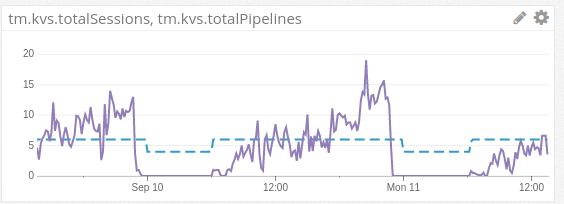

# json2dog

Send JSON data from a URL to datadog.

* [Supported Platforms](#supported-platforms)
* [Usage](#usage)
* [Dependencies](#dependencies)
* [Sample Results](#sample_results)
* [Support](#support)
* [Authors](#authors)

## Supported Platforms 

* Ubuntu or CentOS

## Usage 
	# to get our copy of DataDog::DogStatsd
	cd lib
	export PERL5LIB=`pwd`
	cd ..

	./json2dog health_url statsd_base

where

* `health_url` is a URL to a JSON end point that returns stats we should graph
* `statsd_base` is the start of the metric name that should be sent to datadog

Options can be set by setting environment variables:

	# set port for dogstatsd (optional)
	export DOGSTATSD_PORT=8125

	# enable debug mode
	export JSON2DOG_DEBUG=1

	# log to a file
	export JSON2DOG_LOG=/var/log/json2dog.log

	./json2dog health_url statsd_base

## Dependencies 

* Perl 5
* Perl module [DataDog::DogStatsd](https://github.com/binary-com/dogstatsd-perl) is included
* Perl module JSON
* Perl module LWP::UserAgent

The two standard Perl modules mentioned above can be installed my running
[`prereq.sh`](prereq.sh).

## Sample Results 

## Support 

Please file tickets via [github issues](https://github.com/Telmate/json2dog/issues).

## Authors 

* Christopher Hicks <chicks@telmate.com>
